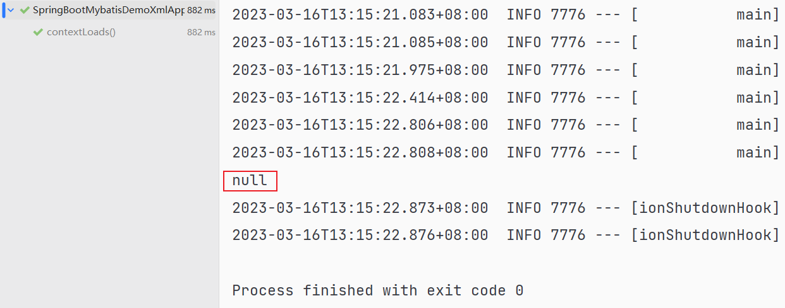
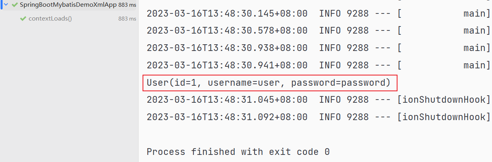

# Spring Boot 与 Mybatis 集成 Demo

## 目录结构

- **非完全 MVC 结构**
- 业务代码极简化，只有 mapper, model 和 resources 下的 mappers
  - 每个文件夹下只有一个文件

## 运行环境

- Java 17
- Spring Boot 3
- Maven

## 运行访问

1. 更改 `application.yml` 中的数据库 username 和 password 为自己的用户名和密码
2. 导入 script 文件夹下的数据库脚本（注意：脚本中有一条 insert 语句，若要查看空数据表的效果，删除该语句即可）
3. IDE 中运行启动测试：`src/test/java/com/tinysnow/SpringBootMybatisDemoXmlApplicationTests.java`
4. 启动测试即可在 terminal 中查看运行效果

## 最终效果

- 导入数据前



- 导入数据后



## 文件更改说明

- 以此 `README.md` 文件当前目录作为相对路径

- ```bash  
  Project                               
  │  .gitignore                                              
  │  pom.xml                         
  │  README.md                       
  │  spring-boot-mybatis-demo-xml.iml
  │                                  
  ├─image
  │      success-after-insert-user-data.png
  │      success-before-insert-user-data.png
  │
  ├─script
  │      spring_boot_mybatis_demo_xml.sql
  │
  └─src
      ├─main
      │  ├─java
      │  │  └─com
      │  │      └─tinysnow
      │  │          │  SpringBootMybatisDemoXmlApplication.java
      │  │          │
      │  │          ├─mapper
      │  │          │      UserMapper.java
      │  │          │
      │  │          └─model
      │  │                  User.java
      │  │
      │  └─resources
      │      │  application.yml
      │      │
      │      └─mappers
      │              UserMapper.xml
      │
      └─test
          └─java
              └─com
                  └─tinysnow
                          SpringBootMybatisDemoXmlApplicationTests.java
  
  ```

### 无更改

- `./src/main/java/com/tinysnow/SpringBootMybatisDemoXmlApplication.java` 无更改

### 有更改

- `./pom.xml` 添加以下依赖
  - `lombok`：简化 model 开发，自动生成 setter 和 getter
  - `mysql-connector-java`：连接 MySQL 数据库
  - `mybatis-spring-boot-starter`：Mybatis 框架的 Spring Boot 服务
- `./src/main/resources/application.yml` 进行以下配置
  - `dataSource` 数据源
  - Mybatis 寻找 `Mapper.xml` 的路径
- `./image` 文件夹添加最终效果图
- `./script` 添加 SQL 数据库脚本
- `./src/main/java/tinysnow` 添加 `mapper` 和 `model` 文件夹
  - 包括文件夹下的所有文件
- `./src/main/resources` 添加 `mappers` 文件夹
  - 所有 Mybatis ORM 映射文件均添加在内