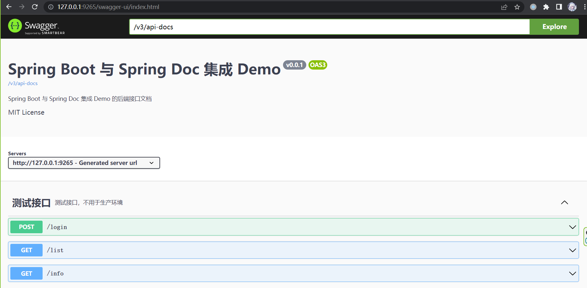
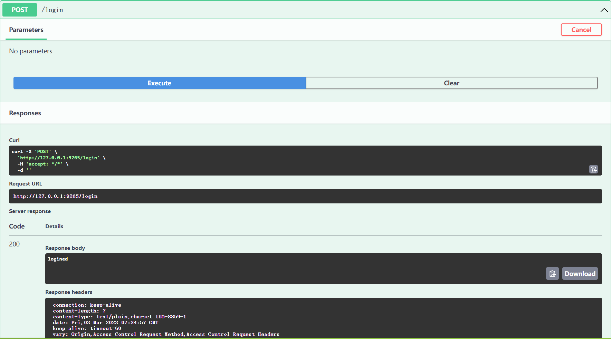

# Spring Boot 与 Spring Doc 集成 Demo

## 目录结构

- MVC 结构，与普通 Spring Boot 项目相同
- 业务代码极简化，只有 config 和 controller
  - config 配置 Spring Doc
  - controller 配有三个 RESTful API
    - "/list" - GET
    - "/info" - GET
    - "/login" - POST

## 运行环境

- Java 17
- Spring Boot 3

## 运行访问

- 无需额外工作
- IDE 中运行启动该项目即可
- 启动后访问 [Swagger UI](http://localhost:9265/swagger-ui/index.html)

## 最终效果





## 文件更改说明

- 以此 `README.md` 文件当前目录作为相对路径

```bash
PROJECT
│  .gitignore
│  HELP.md
│  pom.xml
│  README.md
│  spring-boot-spring-doc-demo.iml
│
├─image
│      result-restcontroller-login-success.png
│      result-whole.png
│
└─src
  ├─main
  │  ├─java
  │  │  └─tinysnow
  │  │      └─demo
  │  │          │  SpringBootSpringDocDemoApplication.java
  │  │          │
  │  │          ├─config
  │  │          │      SpringDocConfiguration.java
  │  │          │
  │  │          └─controller
  │  │                  TestController.java
  │  │
  │  └─resources
  │      │  application.yml
  │      │
  │      ├─static
  │      └─templates
  └─test
      └─java
          └─tinysnow
              └─demo
                      SpringBootSpringDocDemoApplicationTests.java
```

### 无更改

- `./src/main/java/tinysnow/demoSpringBootSpringSecurityDemoApplication.java` 无更改
- `./src/test` 文件夹下所有内容无更改

### 有更改

- `./pom.xml` 添加 spring doc 的 spring boot 3 依赖，详情自行查看
- `./src/main/resources/application.yml` 仅配置服务器端口号
- `./image` 文件夹添加最终效果图
- `./src/main/java/tinysnow/demo` 添加 `config` 和 `controller` 文件夹
  - 包括文件夹下的所有文件