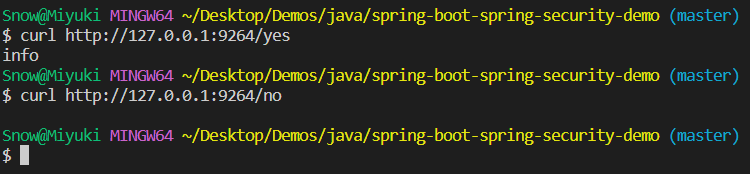

# Spring Boot 与 Spring Security 集成 Demo

## 目录结构

- MVC 结构，与普通 Spring Boot 项目相同
- 业务代码极简化，只有 config 和 controller
  - config 配置 Spring Security
  - controller 配有两个 RESTful API
    - "/yes" 可以直接访问
    - "/no" 需要鉴权验证

## 最终效果

